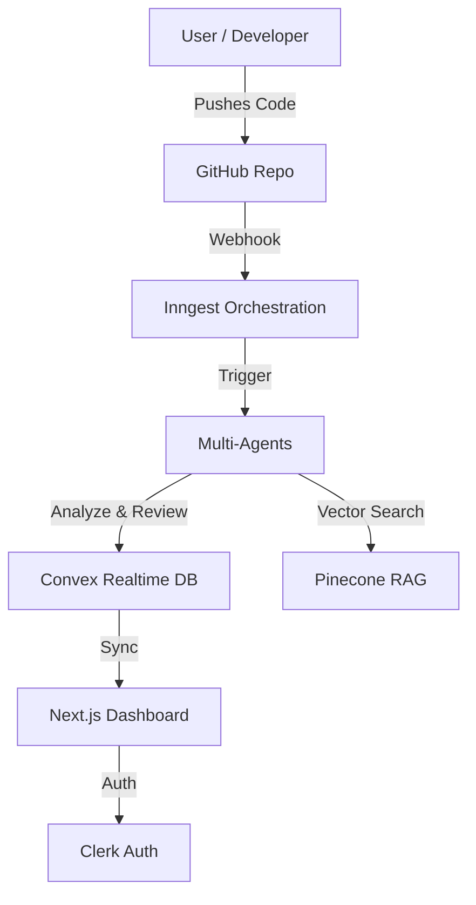

<div align="center">


<h1>🚀 Gitpilot</h1>
<p><strong>The Autonomous DevOps Agent that thinks, reviews, and acts — so your team doesn't have to.</strong></p>

[](https://nextjs.org/)
[](https://convex.dev/)
[](https://deepmind.google/technologies/gemini/)
[](https://inngest.com/)
[](LICENSE)

[**View Deployment**](https://ritesh-rift.vercel.app/) · [**Watch Demo**](https://drive.google.com/file/d/1qqjxeeRt4RPjxDlg2LpJO4TNJB0haKk2/view?usp=sharing) · [**Report Bug**](https://github.com/ronitrai27/rift-gitpilot/issues)

</div>

---

## 📖 What is Gitpilot?

**Gitpilot** is an advanced, autonomous DevOps agent that transforms your GitHub repository into an intelligent, self-managing workspace. It goes beyond traditional CI/CD monitoring by actively participating in the development process — analyzing code semantics, detecting bugs before they deploy, auto-assigning tasks to the right team members, and generating actionable fix suggestions automatically.

> Built for teams that want a **teammate**, not just a dashboard.

---

## 📹 Video Demo

[]([https://drive.google.com/file/d/1qqjxeeRt4RPjxDlg2LpJO4TNJB0haKk2/view?usp=sharing])

_Click the image above to watch the full demo._

---

## ✨ Key Features

### 🤖 Autonomous Auto-Assign Agent

Stop manually routing Jira tickets. The **Auto-Assign Agent** analyzes every new issue and dynamically matches it to the most qualified team member based on their past contributions and expertise.

**Workflow:** New Issue Opened → Fetch Team Skills → Evaluate Best Match → Assign & Notify

### 🔍 Intelligent Commit Analysis

Gitpilot creates a semantic understanding of your code changes:

- **File-by-file diff analysis**: Context-aware review using Gemini 2.5 Flash.
- **Critical Issue Detection**: Identifies logic errors, security flaws, and critical failures.
- **Auto-generated Diagrams**: Visualizes complex logic changes with Mermaid.js.

### 🗺️ Repository Visualization

An interactive **3D / Tree-based Visualizer** that maps your entire codebase and highlights **Risk Heatmaps** — pinpointing areas of high complexity or recurring bugs at a glance.

### 📊 Interactive Team Dashboard

A premium, glassmorphic React dashboard acting as mission control:

| Panel             | Description                                                  |
| ----------------- | ------------------------------------------------------------ |
| **Review Feed**   | Live stream of AI-generated code reviews                     |
| **Issue Tracker** | Kanban-style board for agent-created and user-created issues |
| **Team Stats**    | Real-time visibility into who is working on what             |

---

## 🏗️ Architecture



### Tech Stack

- **Frontend:** Next.js 16 (App Router), React 19, Shadcn/UI, Tailwind CSS, Framer Motion, React Flow
- **Backend:** Convex (Real-time DB), Clerk (Auth), Inngest (Background Jobs & Workflows)
- **AI & Data:** Google Gemini 2.5 Flash, Pinecone (Vector DB), Google AI SDK
- **Tools:** Biome, TypeScript

---

## 🐛 Supported Bug Types

Gitpilot's AI analyzer is specifically tuned to detect:

1.  **Logic Errors** (e.g., Infinite loops, incorrect conditional logic)
2.  **Security Flaws** (e.g., Hardcoded API keys, injection vulnerabilities)
3.  **Critical Failures** (e.g., Unhandled exceptions, type mismatches that break build)
4.  **Severe Bad Practices** (e.g., Anti-patterns that significantly degrade performance)

_Note: The agent is configured to report only high-confidence, critical issues (Max 2 per commit) to reduce noise._

---

## ⚠️ Known Limitations

- **Context Window**: Analysis is currently optimized for files under 4,000 characters to ensure speed and accuracy.
- **Critical Issue Cap**: To prevent alert fatigue, only the top 2 most critical issues are reported per commit.
- **Webhook Requirement**: Local development requires a public tunnel (ngrok) for GitHub webhooks to trigger Inngest functions.

---

## 🚀 Getting Started

### Prerequisites

- Node.js 18+
- A GitHub account and repository
- API keys for: Convex, Clerk, Pinecone, Google Gemini, Inngest

### Installation

1.  **Clone the repository**

    ```bash
    git clone https://github.com/ronitrai27/rift-gitpilot
    cd gitpilot
    ```

2.  **Install dependencies**

    ```bash
    npm install
    # or
    pnpm install
    ```

3.  **Environment Setup**
    Copy the example environment file:

    ```bash
    cp .env.example .env.local
    ```

    Fill in `env.local` with your keys:

    ```env
    NEXT_PUBLIC_CONVEX_URL=...
    NEXT_PUBLIC_CLERK_PUBLISHABLE_KEY=...
    CLERK_SECRET_KEY=...
    GOOGLE_GENERATIVE_AI_API_KEY=...
    INNGEST_EVENT_KEY=...
    PINECONE_API_KEY=...
    ```

### Run Locally

1.  **Start the development server**

    ```bash
    npm run dev
    ```

2.  **Start Convex** (in a new terminal)

    ```bash
    npx convex dev
    ```

3.  **Start Inngest** (in a new terminal)
    ```bash
    npx inngest-cli@latest dev
    ```

Open [http://localhost:3000](http://localhost:3000) to access your Gitpilot instance.

---

## 👥 Team

- **Ritesh Sinha**
- **Ronit Rai**
- **Bhanu Pratap**
- **Riya Kumari**

---

## 📄 License

This project is licensed under the MIT License. See [LICENSE](LICENSE) for details.
